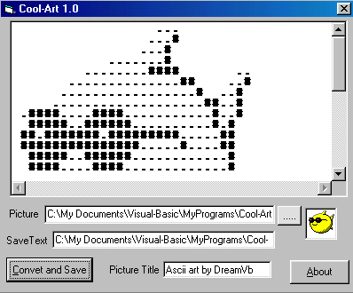



## Icon To Text

### Description

This code will take a 32x32 Windows Icon and Convert it in to a text file
 
### More Info
 
This code will return a Txt file form a Windows Icon

No Side Effects of any

             |
---                |---
**Submitted On**   |2001-05-06 10:28:34
**By**             |[dreamvb](https://github.com/Planet-Source-Code/PSCIndex/blob/master/ByAuthor/dreamvb.md)
**Level**          |Intermediate
**User Rating**    |5.0 (45 globes from 9 users)
**Compatibility**  |VB 4\.0 \(16\-bit\), VB 4\.0 \(32\-bit\), VB 5\.0, VB 6\.0
**Category**       |[Complete Applications](https://github.com/Planet-Source-Code/PSCIndex/blob/master/ByCategory/complete-applications__1-27.md)
**World**          |[Visual Basic](https://github.com/Planet-Source-Code/PSCIndex/blob/master/ByWorld/visual-basic.md)
**Archive File**   |[CODE\_UPLOAD57315122000\.zip](https://github.com/Planet-Source-Code/dreamvb-icon-to-text__1-8042/archive/master.zip)

